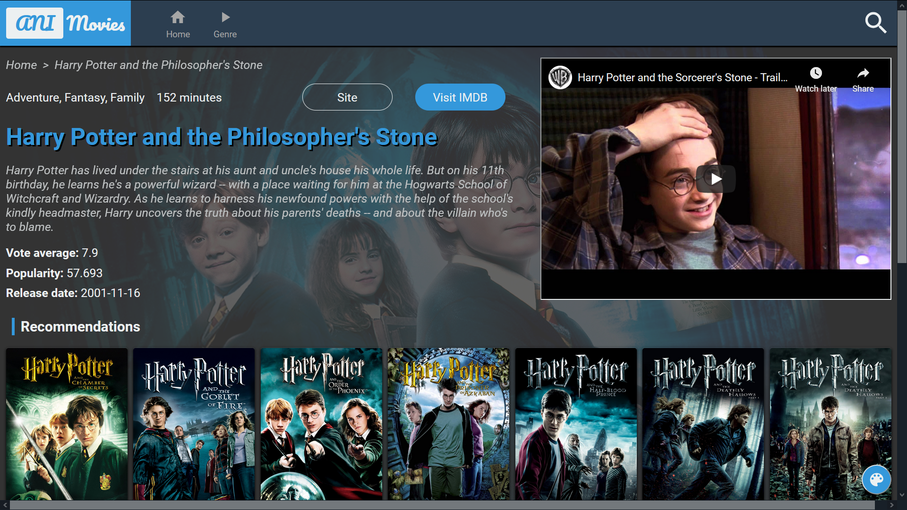
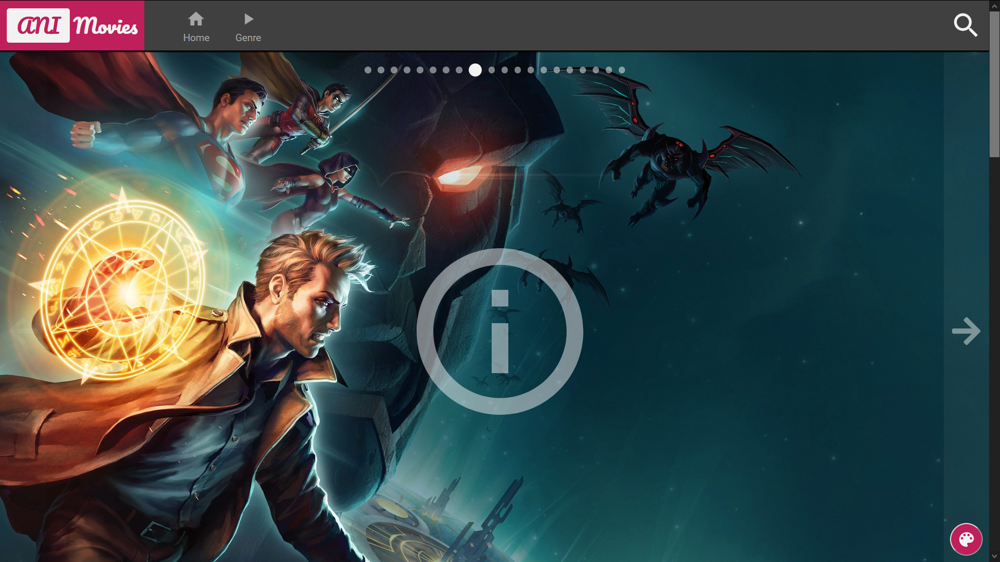
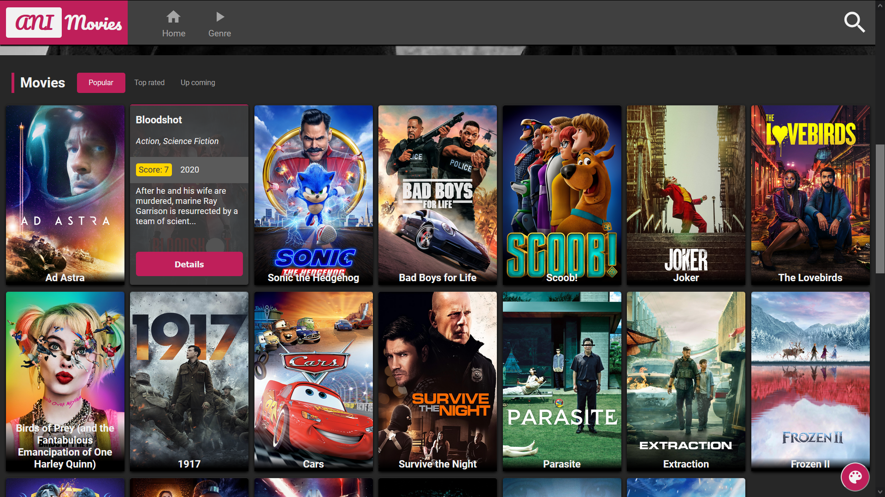
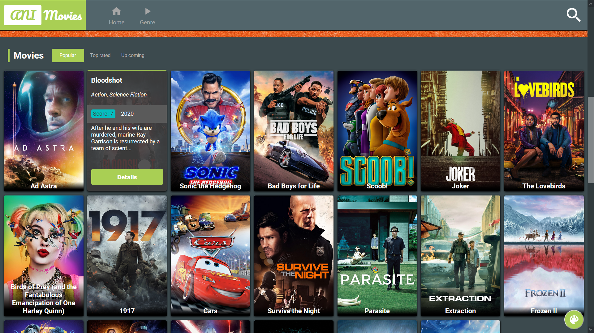
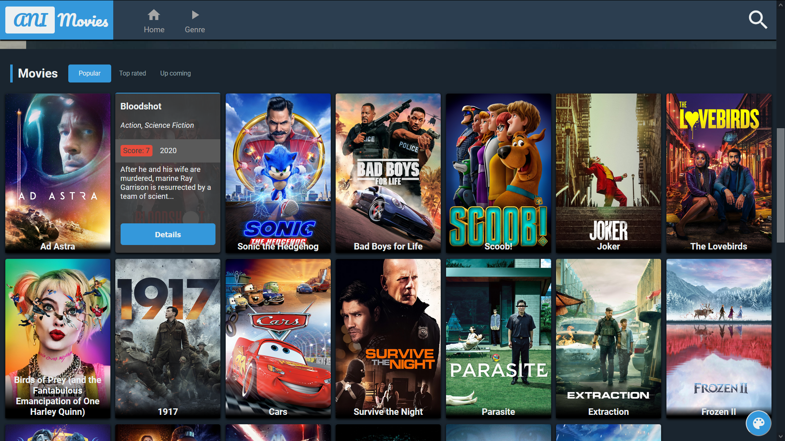
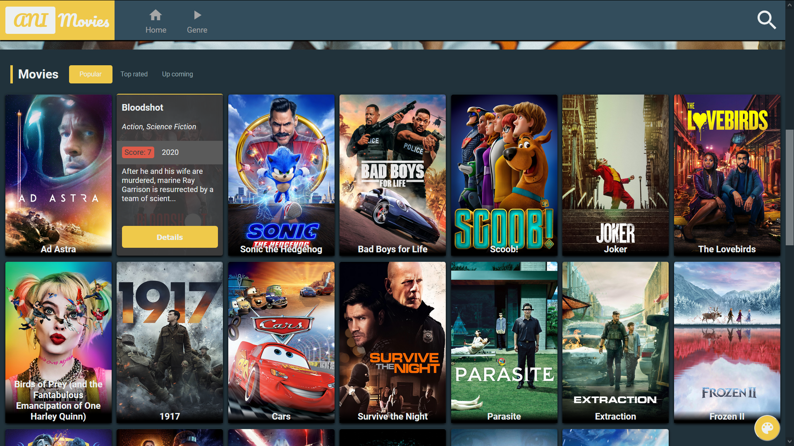
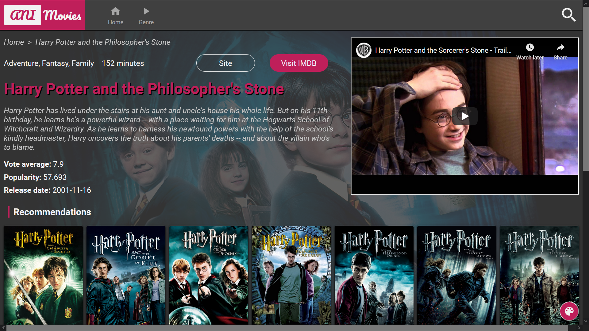
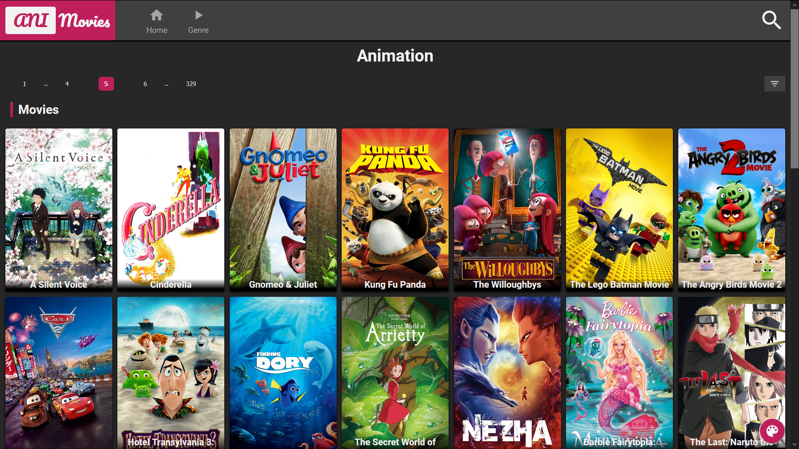
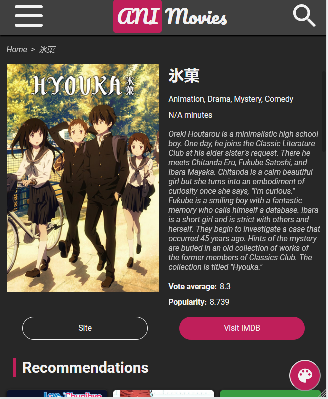
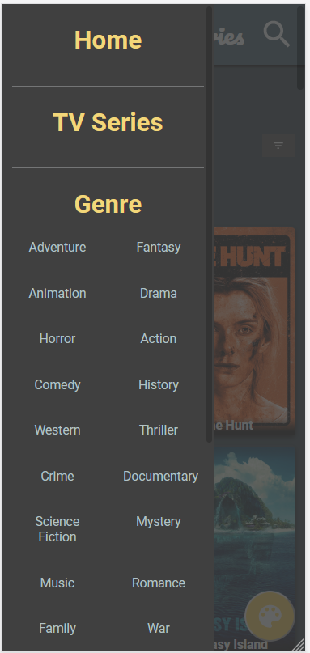

This project was bootstrapped with [Create React App](https://github.com/facebook/create-react-app), using the [Redux](https://redux.js.org/) and [Redux Toolkit](https://redux-toolkit.js.org/) template.

AniMovies utilizes _TheMovieDB_ for fetching movies/tv-series info.

## Built with

- **Library:** React
- **State management:** Redux, redux-thunk
- **Router:** react-router
- **Styling:** styled-components, polished
- **Animation:** framer-motion

## Demo video (youtube)

## Screenshots

